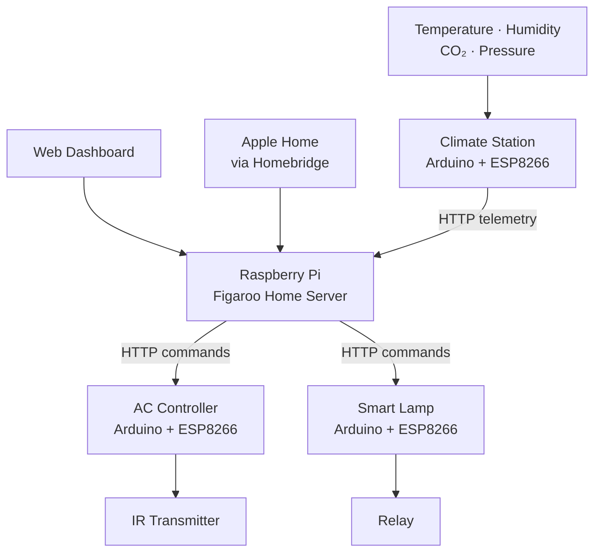
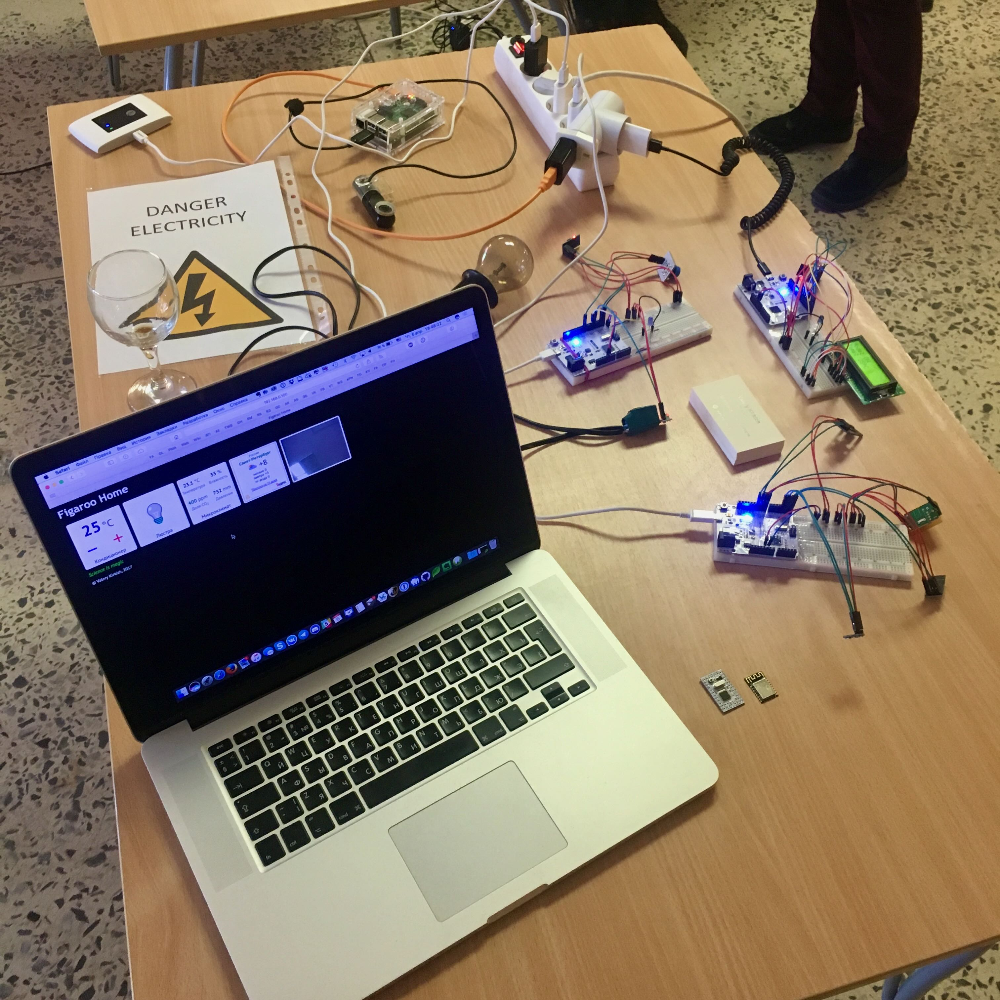
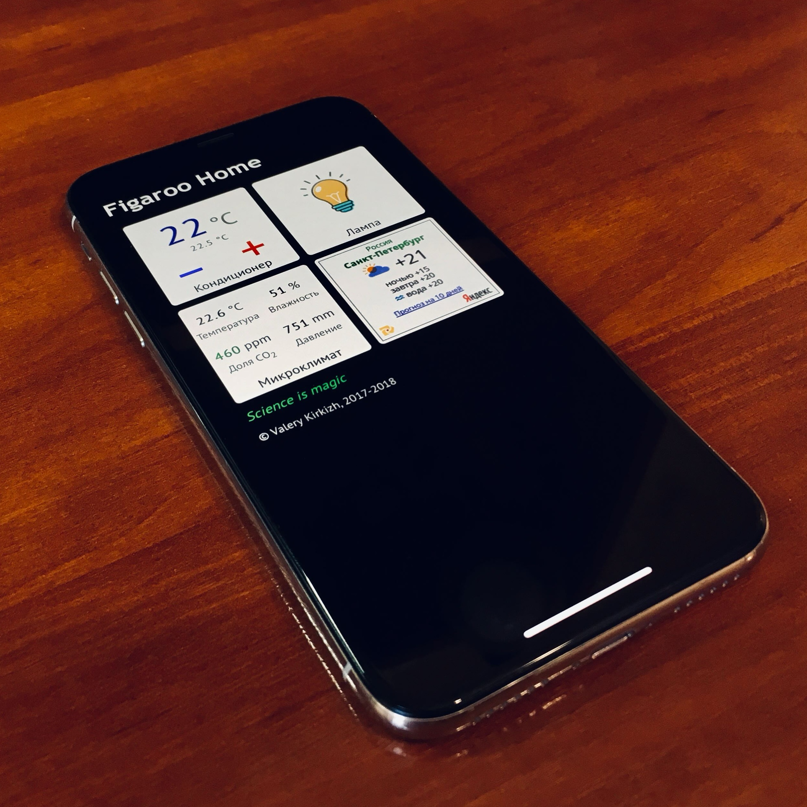

# Figaroo Home

A custom smart home system I built and used between 2017 and 2020.

The system connected several DIY devices based on Arduino and ESP8266 to a central Raspberry Pi server. It provided a web dashboard for monitoring and controlling the apartment and was later integrated with Apple Home via Homebridge.

## What it could do

- Control an air conditioner using an IR transmitter
- Switch a custom smart lamp
- Monitor temperature, humidity, CO₂ and atmospheric pressure
- Monitor climate data and control devices through a web dashboard
- Integrate devices with Apple Home through Homebridge

## Architecture



The Climate Station periodically sent sensor readings to the server over HTTP, while the server used HTTP to send commands to the air conditioner and lamp controllers.

## Devices

### Climate Station

Indoor climate monitoring station measuring:
- temperature
- humidity
- CO₂ concentration
- atmospheric pressure

### Air Conditioner Controller

An IR-based controller that reproduced commands from the original remote and allowed the air conditioner to be controlled from the web interface.

### Smart Lamp

A custom network-connected lamp controller based on a relay.

## Demo

### Hardware setup



Raspberry Pi server and several Arduino/ESP8266 prototypes during development.

### Web dashboard



Mobile version of the web dashboard showing air conditioner controls, lamp control, indoor climate measurements and weather information.

## Repository structure

```text
devices/   Firmware and code for Arduino/ESP8266 devices
server/    Raspberry Pi server and web application
pictures/  Project photos and screenshots
```

## Technology

- Raspberry Pi
- Arduino
- ESP8266
- PHP
- JavaScript
- Python
- Homebridge
- HTTP
- IR
- Environmental sensors

## Project status

Historical project developed and used between 2017 and 2020.

It is no longer maintained; this repository preserves the original implementation.

## Author

Valery Kirkizh

[valery@kirkizh.com](mailto:valery@kirkizh.com)
